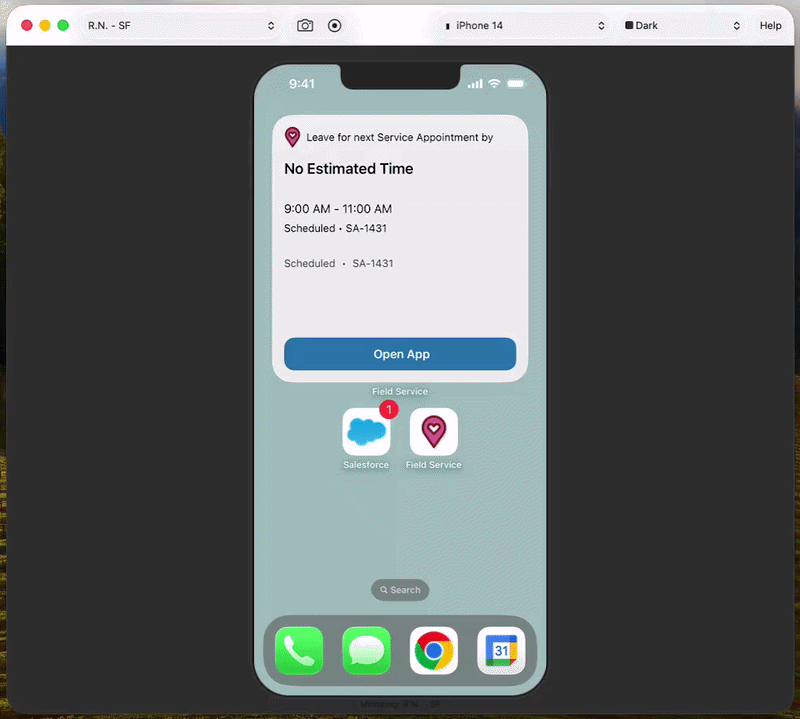

# RafScreen

A native macOS app that mirrors your iPhone or iPad screen via USB, wrapped in a beautiful device bezel frame. Built with Swift and AppKit using CoreMediaIO + AVFoundation.

<p align="center">
  
</p>

 

## ✨ Features

- **Screen Mirroring** — Mirror any connected iOS device screen in real-time via USB
- **Device Bezels** — 40+ programmatically rendered device frames (iPhone 8 through iPhone 17 Pro Max, iPads)
- **Auto-Detect** — Automatically identifies the connected device model by screen resolution
- **Screenshot** — Save the current screen with bezel overlay as PNG (Cmd+S)
- **Recording** — Record the mirrored screen to a .mov file (Cmd+R)
- **Landscape Support** — Bezel automatically rotates when the device switches to landscape orientation
- **Device Hot-Swap** — Seamlessly switch between devices without restarting
- **Background Themes** — Dark, Black, Light, Gray, Sepia, and Green Screen (chroma key)
- **Zoom Controls** — Resize the display to fit your workflow

## 🚀 Getting Started

### Requirements

- macOS 13.0 (Ventura) or later
- An iPhone or iPad connected via USB cable

### Option 1: Download the DMG (Recommended)

1. Download the `.dmg` file from the [`dist/`](https://github.com/rafnobrega/RafScreen/tree/main/dist) folder
2. Open the DMG and drag **RafScreen.app** to your Applications folder
4. Double-click to launch

> ⚠️ **Heads up:** Since RafScreen is not signed with an Apple Developer certificate, macOS will probably block it the first time. Just go to **System Settings > Privacy & Security**, scroll down, and hit **Open Anyway**. After that, it won't bug you again.

### Option 2: Build from Source

```bash
git clone https://github.com/rafnobrega/RafScreen.git
cd RafScreen
bash build.sh
open build/RafScreen.app
```

> Requires Xcode Command Line Tools (`xcode-select --install`).

### 📱 Connect Your Device

1. Plug your iPhone or iPad into your Mac via USB (Lightning or USB-C)
2. Unlock the device
3. Tap **Trust** on the "Trust This Computer?" prompt if it appears
4. Unplug and plug the device back in — this is required after the first trust
5. RafScreen will automatically detect the device and start mirroring

## ⌨️ Keyboard Shortcuts

| Shortcut | Action |
|----------|--------|
| Cmd+S | Save screenshot to Desktop |
| Cmd+R | Start/Stop recording |
| Cmd+0 | Actual size |
| Cmd++ | Zoom in |
| Cmd+- | Zoom out |
| Cmd+Q | Quit |

## 📋 Supported Devices

### iPhones
iPhone 8, SE (2nd/3rd gen), X, XS, XR, 11 series, 12 series, 13 series, 14 series, 15 series, 16 series, 17 series

### iPads
iPad (8th gen), iPad Mini, iPad Air (3rd/4th gen), iPad Pro 9.7"/10.5"/11"/12.9" (multiple generations)

## ⚙️ How It Works

RafScreen uses Apple's CoreMediaIO framework to enable iOS device screen capture over USB. Connected iOS devices appear as AVFoundation capture devices with muxed (audio+video) media type. The app reads the native pixel resolution from the video stream to auto-detect the device model and render the matching bezel using CoreGraphics.

## 📄 License

MIT
